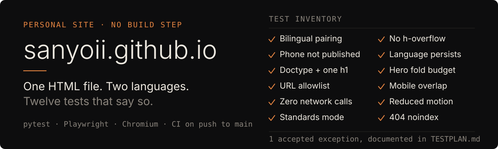
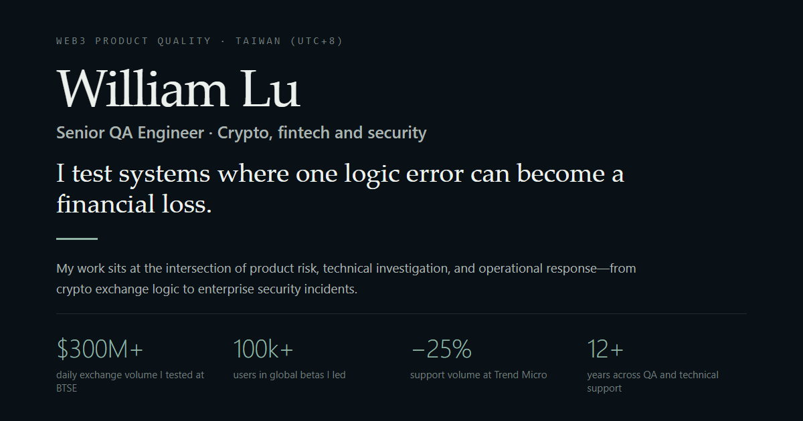

<p align="center">
  
</p>

<p align="center">
  <a href="https://sanyoii.github.io/"><strong>sanyoii.github.io</strong></a> ·
  <a href="TESTPLAN.md">Test plan</a> ·
  <a href="README.zh-TW.md">繁體中文</a> ·
  <a href="https://github.com/sanyoii/sanyoii.github.io/actions/workflows/tests.yml"></a>
</p>

Personal site for **William Lu** — Senior QA Engineer focused on Web3 product
quality, fintech risk, and technical support, working remote from Taiwan (UTC+8).

The site itself is one hand-written `index.html`. No framework, no build step, and no
external requests at runtime. It is bilingual (English / 繁體中文) through paired
`data-en` and `data-zh` attributes rather than a routing layer or a translation library.

The reason this repository is public is the other half of it. A portfolio that claims QA
experience should be able to show its own risk analysis, so this one ships with
[TESTPLAN.md](TESTPLAN.md) and twelve automated checks — seventeen cases once the
parametrised viewports are counted — that run in CI on every push to `main`. If you
came here to judge how I work rather than what I claim, start there.

<p align="center">
  
</p>

## What the tests actually protect

Each check exists because a specific failure would matter. The full table lives in
[TESTPLAN.md](TESTPLAN.md); this is the reasoning behind it.

| Risk | Why it matters | Test response |
|---|---|---|
| One language is incomplete | Visitors see mixed-language content | Compare paired text and image-`alt` attributes |
| Personal contact data leaks | Privacy exposure | Scan both HTML files for known phone fragments |
| Invalid document structure | Inconsistent rendering and weak semantics | Check doctype, standards mode, and one `h1` |
| A new external dependency appears | Privacy, reliability, supply-chain regression | Allowlist source URLs and intercept browser requests |
| Responsive content overflows | Navigation becomes hard to use | Check horizontal overflow and fold budgets at 375 / 768 / 1440 px |
| Language state diverges from metadata | Poor bilingual UX, inaccurate search snippets | Toggle, inspect, and reload persisted state |
| Motion preference hides content | Reduced-motion users miss information | Emulate reduced motion and inspect every `.fade` |
| The 404 page becomes indexable | Search pollution and dead ends | Validate `noindex` and the home link |

## One exception, written down

At 375 × 812 in English, the bottom of `.ctas` sits slightly below the fold. That
spacing tradeoff is accepted rather than hidden, and the test is scoped to say so:

> The test deliberately does not claim that the English CTA group is above the fold at
> this size. It still requires English and Chinese `.avail`, plus the Chinese `.ctas`,
> to remain within the viewport.

A suite that quietly asserts something untrue is worse than one that states its limits.

## Decisions worth explaining

| Decision | Reasoning |
|---|---|
| No framework, no build step | The site is a few hundred lines of content. A toolchain would add failure modes without removing any. |
| No external runtime requests | Nothing to leak, nothing to break when a third party changes. A test enforces it rather than trusting review. |
| Bilingual via `data-en` / `data-zh` | One document stays in sync by construction. Two translated files drift the moment one is edited. |
| CI on push only, no cron | An unchanged portfolio should not accumulate a permanently red badge from unattended browser or runner updates. |
| Chromium only | Cross-browser coverage is explicitly out of scope, and the plan says so instead of implying breadth the suite does not have. |

## Run it

The site needs nothing:

```bash
# open index.html directly, or
python -m http.server
```

The suite needs Python and Chromium:

```bash
python -m pip install -r tests/requirements.txt
python -m playwright install chromium
python -m pytest tests/ -v
```

## Layout

```text
index.html              the site
404.html                noindexed, links home
assets/                 images used by the site
assets/readme/          the hero graphics on this page (en / zh)
make_og_card.py         regenerates assets/og-card.png from index.html
TESTPLAN.md             scope, risk analysis, test inventory, accepted exception
tests/
  test_static.py        HTML-level checks, no browser
  test_runtime.py       Chromium behavior over a local HTTP server
  conftest.py           server fixture and shared paths
.github/workflows/      CI, push to main only
```

## Scope

This is a personal site, not a template. It is public so the work can be inspected;
the writing, images, and career content are mine and not intended for reuse.
