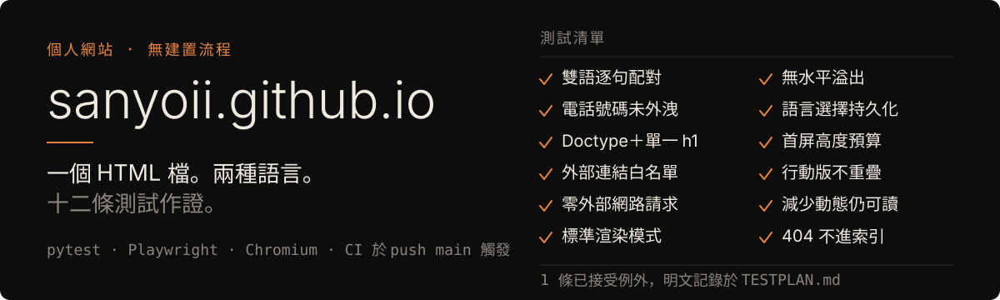

<p align="center">
  
</p>

<p align="center">
  <a href="https://sanyoii.github.io/"><strong>sanyoii.github.io</strong></a> ·
  <a href="TESTPLAN.md">測試計畫</a> ·
  <a href="README.md">English</a> ·
  <a href="https://github.com/sanyoii/sanyoii.github.io/actions/workflows/tests.yml"></a>
</p>

這是 **William Lu**（呂理瑋）的個人網站——資深 QA 與客戶技術支援團隊負責人，於台灣（UTC+8）遠端工作。

網站本體是一個手寫的 `index.html`。沒有框架、沒有建置流程、執行期零外部請求。
雙語（English／繁體中文）靠成對的 `data-en`／`data-zh` 屬性實現，而不是路由層或翻譯函式庫。

這個 repo 公開的理由是：一個有工作經驗的 QA，應該拿得出自己的簡單作品集風險分析。
所以這裡附有 [TESTPLAN.md](TESTPLAN.md) 與十二條自動化測試——把參數化的視窗尺寸
算進去是十七個案例——每次 push 到 `main` 都在 CI 上執行。
如果你是來評估我怎麼工作、而不只是光看 Title——從那裡開始看。

<p align="center">
  
</p>

## 這些測試在保護什麼

每條測試檢查的存在，都是因為東西失效真的有代價。完整表格在
[TESTPLAN.md](TESTPLAN.md)，這裡是背後的推理。

| 風險 | 為什麼重要 | 測試對策 |
|---|---|---|
| 其中一種語言不完整 | 訪客看到中英夾雜的內容 | 逐句比對成對文案與圖片 `alt` 屬性 |
| 個人聯絡資料外洩 | 隱私暴露 | 掃描兩個 HTML 檔中的已知電話片段 |
| 文件結構失效 | 渲染不一致、語意薄弱 | 檢查 doctype、標準模式與單一 `h1` |
| 出現新的外部依賴 | 隱私、可靠性、供應鏈退化 | 來源 URL 白名單＋攔截瀏覽器請求 |
| 響應式版面溢出 | 導覽與內容變得難以使用 | 檢查 375／768／1440 px 的水平溢出與首屏預算 |
| 語言狀態與 metadata 脫鉤 | 雙語體驗劣化、搜尋摘要失準 | 切換、檢查、重新載入持久化狀態 |
| 動態偏好把內容藏起來 | 減少動態的使用者漏看資訊 | 模擬 reduced-motion 並逐一檢查每個 `.fade` |
| 404 頁被搜尋引擎收錄 | 搜尋污染與死路 | 驗證 `noindex` 與返回首頁連結 |

## 一條例外，白紙黑字

在 375 × 812 的英文版面，`.ctas` 底部略低於首屏。這個間距取捨被接受而非被藏起來，
測試的斷言範圍也如實照寫：

> 這個測試刻意不宣稱英文 CTA 群組在此尺寸下位於首屏內。它仍要求英文與中文的
> `.avail`、加上中文的 `.ctas`，必須留在視窗範圍內。

一套安靜地斷言不實之事的測試，比一套明說自身極限的測試更糟。

## 值得說明的決策

| 決策 | 理由 |
|---|---|
| 無框架、無建置流程 | 網站就幾百行內容。工具鏈只會增加失效模式，不會移除任何一個。 |
| 執行期零外部請求 | 沒東西可洩漏，第三方變動也弄不壞它。而且由測試強制執行，不靠 review 的自覺。 |
| 雙語用 `data-en`／`data-zh` | 單一文件在結構上就保持同步。兩份翻譯檔從被編輯的那一刻起就開始漂移。 |
| CI 只在 push 觸發、不設 cron | 一個沒有變動的作品集，不該因為無人看管的瀏覽器或 runner 更新而累積一面永久的紅牌。 |
| 只測 Chromium | 跨瀏覽器覆蓋明確列為範圍外——計畫書直說，而不是暗示這套測試有它沒有的廣度。 |

## 跑起來

網站本身什麼都不需要：

```bash
# 直接打開 index.html，或
python -m http.server
```

測試套件需要 Python 與 Chromium：

```bash
python -m pip install -r tests/requirements.txt
python -m playwright install chromium
python -m pytest tests/ -v
```

## 目錄結構

```text
index.html              網站本體
404.html                noindex、附返回首頁連結
assets/                 網站使用的圖片
assets/readme/          本頁的 hero 圖（en / zh）
make_og_card.py         從 index.html 重新產生 assets/og-card.png
TESTPLAN.md             範圍、風險分析、測試清單、已接受例外
tests/
  test_static.py        HTML 層檢查，不開瀏覽器
  test_runtime.py       Chromium 行為測試，走本機 HTTP server
  conftest.py           server fixture 與共用路徑
.github/workflows/      CI，僅 push 到 main 觸發
```

## 範圍聲明

這是個人網站，不是模板。公開是為了讓工作方式可被檢視；
文案、圖片與職涯內容屬於我本人，不供再利用。
